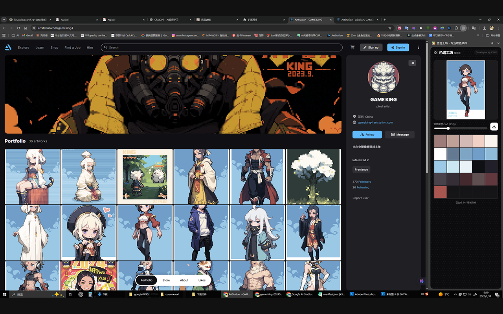

# 色谱工坊 - Palette Workshop 🎨

一款专业、高保真的 Chrome 色彩提取扩展插件。通过智能算法从任何图片中提取精美的配色方案，助力设计师与开发者捕捉色彩灵感。

A professional, high-fidelity color extraction extension for Chrome. Capture color inspiration from any image using smart algorithms.

---

## 📸 预览 | Preview

<!-- 确保你的仓库根目录下有一张名为 preview.png 的图片 -->
<p align="center">
  
</p>

---

## ✨ 核心特性 | Features

- **🎯 智能色彩分析**：采用 K-Means 聚类算法，精准识别并提取图片中的核心色调。
- **🧩 动态宫格密度**：支持从 4x4 (16色) 到 8x8 (64色) 的多种布局，满足不同精度的色彩分析需求。
- **🖱️ 极简交互**：
    - 点击颜色块：自动复制 HEX 色值到剪贴板。
    - 拖拽支持：支持从本地或直接从网页拖入图片进行分析。
- **🖼️ 一键导出**：生成精美的色卡宫格图片，支持本地下载。
- **🌌 沉浸式体验**：高品质深色模式 UI，配备动态点阵背景动画。
- **🌐 离线支持**：完全本地运行，保护隐私，无需联网即可处理图片。

---

## 🚀 安装指南 | Installation

由于目前处于开发版本，您可以按照以下步骤手动安装：

1. **下载代码**：点击 `Code` -> `Download ZIP` 或使用 Git 克隆仓库。
   ```bash
   git clone https://github.com/your-username/palette-workshop.git
   ```
2. **打开扩展程序页面**：在 Chrome 地址栏输入 `chrome://extensions/`。
3. **开启开发者模式**：勾选页面右上角的“开发者模式 (Developer mode)”。
4. **加载插件**：点击“加载已解压的扩展程序 (Load unpacked)”，选择本项目所在的文件夹。
5. **固定插件**：点击 Chrome 工具栏的拼图图标，将“色谱工坊”固定在侧边栏。

---

## 🛠️ 技术实现 | Technical Stack

- **Vanilla JS & ES6 Modules**：无框架依赖，保证轻量与极致性能。
- **Canvas API**：高效的图像采样与色卡生成。
- **K-Means Algorithm**：自定义实现的机器学习聚类算法，用于色彩量化。
- **Chrome Extension API (Manifest V3)**：利用最新的扩展程序规范，支持 Side Panel 侧边栏常驻。

---

## 📄 许可证 | License

本项目基于 [Apache-2.0](LICENSE) 许可证开源。

---

## 👨‍💻 作者 | Author

Developed by **KING**

> 捕捉光影，重塑色彩。
> Capturing light, reshaping color.
